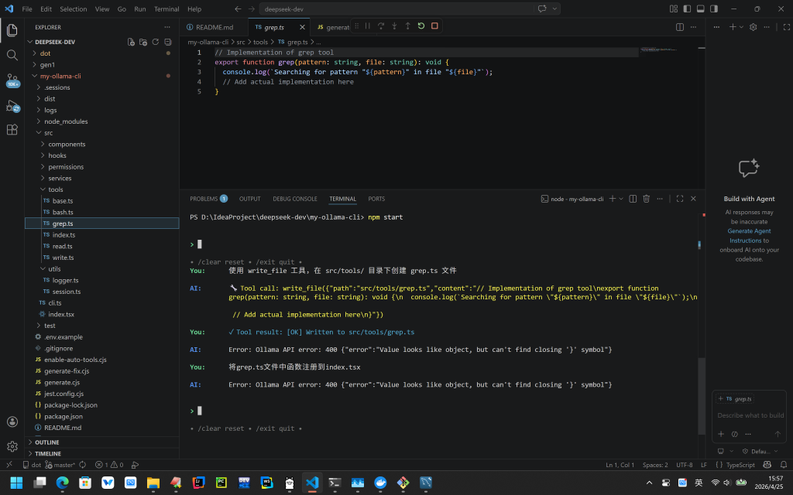

# My Ollama CLI

A terminal-based AI assistant powered by **Ollama** (qwen2.5-coder:7b) with tool calling.

## Setup

1. Install [Ollama](https://ollama.com/) and pull the model:
   ```bash
   ollama pull qwen2.5-coder:7b
   ```
2. Copy `.env.example` to `.env` (optional)
3. Run `npm install`
4. Run `npm run build`
5. Run `npm start`

## Usage

- Type your message and press Enter.
- Use `/clear` to reset, `/exit` to quit.


## prompts

   -- 基于现有Claude Code源码，帮我生成一个类似的功能简单能完整运行的项目代码，不需要连接Anthropic ，使用本地ollama的qwen2.5-coder:7b模型，全部代码生成一个构建脚本

   --  一堆的错误反馈交互修改

   -- 如何才能让这个机器人使用工具，请给出修改脚本

   -- 添加与ollama对话历史清除功能

## 效果

   -- 
      • /clear reset • /exit quit •
      You:      使用 write_file 工具，在 src/tools/ 目录下创建 grep.ts 文件

      AI:      🔧 Tool call: write_file({"path":"src/tools/grep.ts","content":"// Implementation of grep 
               tool\nexport function grep(pattern: string, file: string): void {\n  console.log(`Searching
               for pattern \"${pattern}\" in file \"${file}\"`);\n  // Add actual implementation 
               here\n}"})

      You:      ✓ Tool result: [OK] Written to src/tools/grep.ts
 
 -- 
           
      